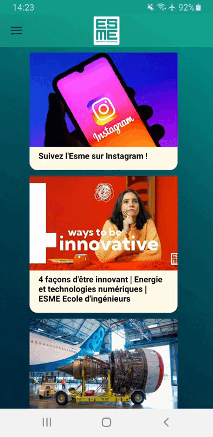

# My-Digital-Campus-Mobile
A prototype app that could be used by students at my school.

## Demo
1. Sign in using your personal credentials. All names, classes, emails and passwords were stored in a *Firebase* database.

 
 
2. The app starts by showing you the general feed news. 
 
 

3. You can navigate in the app using a side panel. Student timetables and grades were stored in an online database.
 
 
 
4. The data has been organized using Python and the database has been populated using Java. You can see this here [/populateEsmeDB](/populateEsmeDB).

## Context
This project was developed during my 3rd year at engineering school in the *Innovation* Major.
